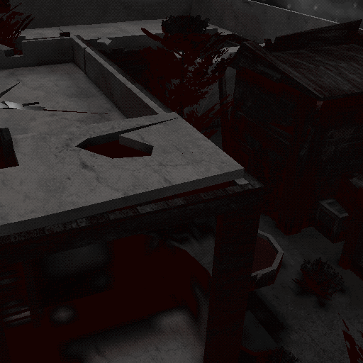

Haunted
=======

About
-----

This is a map ported from the [Western Quake 3 mod](https://www.moddb.com/mods/western-quake-3) to the [Smokin' Guns](https://www.smokin-guns.org/) game. It features an old ghost town in New Mexico with bank robbery gameplay.

It was ported from `br_haunted.pk3` from [western.bsdmon.com](http://western.bsdmon.com/stuff/br_haunted.pk3) ([archive](https://web.archive.org/web/20070302190043/http://western.bsdmon.com/stuff/br_haunted.pk3)) using the `esquirel` tool from the [Urcheon](https://github.com/DaemonEngine/Urcheon) tool suite.

Credits
-------

Smokin' Guns port:

- Thomas “illwieckz” Debesse <dev@illwieckz.net> (http://gg.illwieckz.net)

Mapping:

- Banana Head <bananahead@gmail.com>
- Jak <jakmanjak@gmail.com>

Special thanks:

- Edwin “ReD NeCKersoN” Jirouch
- Tor “Torhu” Husaboe
- Draco Icebane
- Mugenmidget

History
-------

- 2020-04-20: Smokin'Guns port
- 2005-05-06: First version